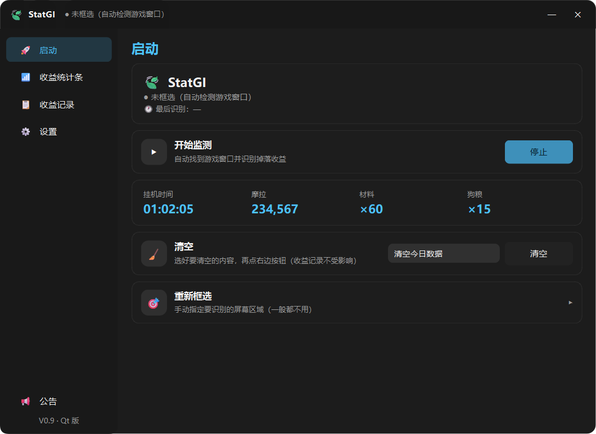
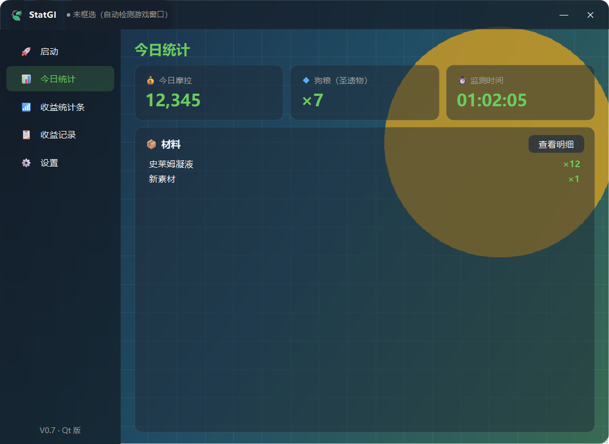
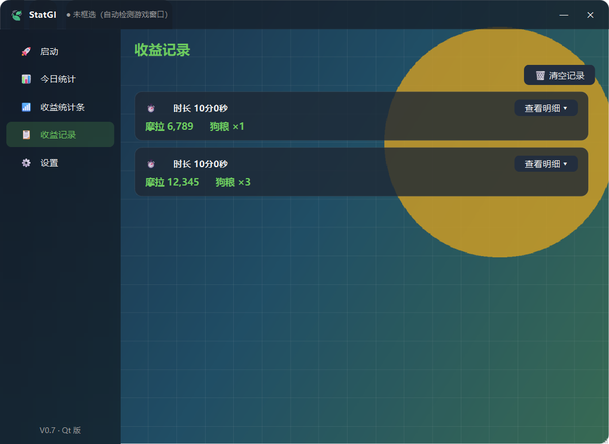
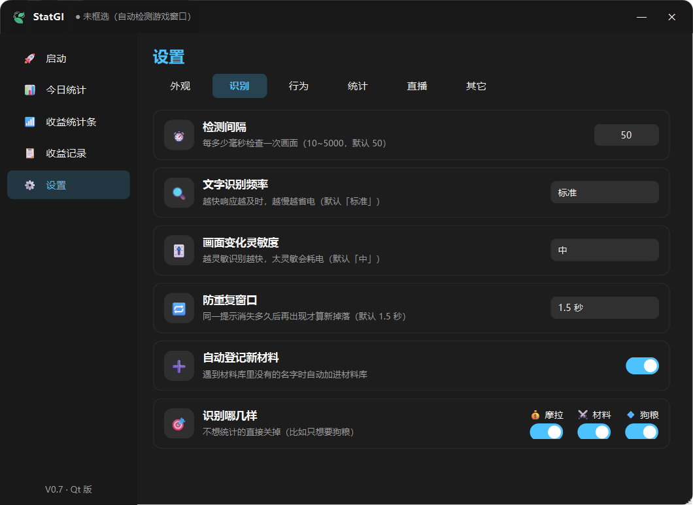
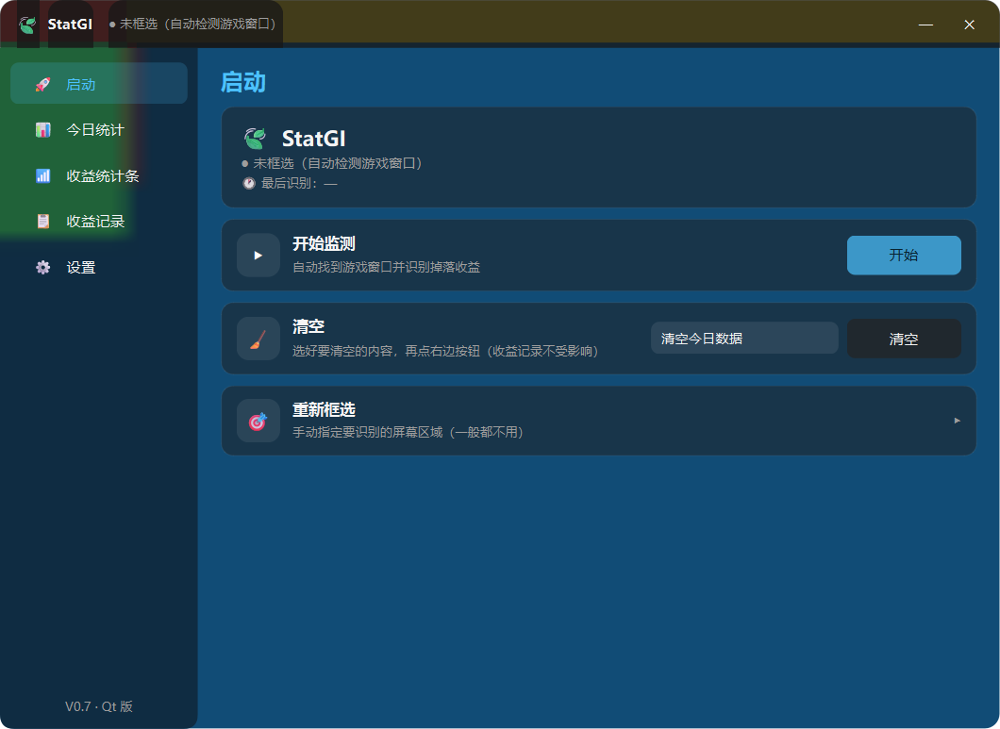

# 🍃 StatGI — 原神挂机收益统计器

**StatGI** 是一个 Windows 桌面工具，通过 **屏幕捕捉 + OCR 文字识别**，自动统计原神挂机打怪期间的收益（摩拉 / 材料 / 圣遗物·狗粮）。

> 不读取游戏内存、不注入、不修改游戏 —— 仅识别屏幕上的拾取提示，安全、稳定，适合长期挂机与直播场景。

当前版本：**v0.9**

---

## 📸 界面

| 启动 | 今日统计 |
|:---:|:---:|
|  |  |

| 收益记录 | 收益统计条（直播间小窗口） |
|:---:|:---:|
|  |  |

| 设置（分 6 类） | 自定义背景图 |
|:---:|:---:|
|  |  |

- 无边框窗口 + **真圆角**（自己画的圆角路径 + 抗锯齿，Windows 10 / 11 都有）
- 侧边栏导航 + 卡片式布局，深色主题
- **半透明玻璃界面**：自定义背景图时，卡片 / 侧边栏 / 按钮都是真的半透明，底图透出来
- **设置项即时生效**：改完立刻看到效果，没有「保存」按钮

---

## ✨ 功能特性

### 识别与统计

| 功能 | 说明 |
|------|------|
| 摩拉统计 | 识别 `摩拉 ×200`，自动累计今日摩拉 |
| 材料统计 | 识别 `破损的面具 ×2`，按名称统计（内置 574 种材料库） |
| 圣遗物（狗粮） | 出现圣遗物自动计数（内置 299 种圣遗物名单） |
| 未知材料自动登记 | 遇到材料库里没有的名字自动加进去，不用手动维护 |
| 防重复统计 | 拾取提示 Track 生命周期去重，同一提示只统计一次，窗口时长可调 |
| 提示栏锚点定位 | 识别「获得」标题自动定位，无需手动框选 |
| 只采集游戏窗口 | 用 PrintWindow 截取原神窗口本身内容，叠加在游戏上的其它工具提示不会混入 |
| 只在原神前台识别 | 切到别的窗口自动暂停，回到原神自动继续 |
| 每日统计 | 自动换日归档、本地保存、一键清空；**换日时间可设**（0 点 / 凌晨 4 点等） |
| 监测记录 | 每次「开始监测 → 停止监测」生成一条记录，可回看每段挂机的收益 |
| 性能档位 | 文字识别频率 / 画面变化灵敏度统一 4 档：**性能 / 标准 / 省电 / 极致省电**，挂机时调到「省电」能明显降低占用 |

### 外观与界面

| 功能 | 说明 |
|------|------|
| 自定义背景图片 | 选一张图当窗口背景，整个界面半透明玻璃效果 |
| 卡片透明度 | 卡片 / 侧边栏 / 按钮统一调，0% = 全透明 |
| 背景压暗 | 背景图太花时压暗一点，字更清楚 |
| 左侧栏毛玻璃 | 侧边栏模糊 + 压暗，磨砂质感 |
| 背景色 / 强调色 | 内置 4 组背景色 + 5 组强调色，**改完立即生效，不用重启** |
| 设置分 6 类 | 外观 / 识别 / 行为 / 统计 / 直播 / 其它，不用在一长条里翻 |
| 折叠区 | 「显示项目」「识别哪几样」点标题就地展开，收起时标题下就显示当前选中了什么 |

### 使用便利

| 功能 | 说明 |
|------|------|
| 全局热键 | 自定义一个键组合，游戏里随时开始 / 停止监测 |
| 系统托盘 | 最小化到托盘后台继续监测 |
| 任务栏 / Alt+Tab | 正常出现在任务栏、缩略图预览、任务视图 |
| 收益统计条 | 直播间小窗口（摩拉 / 材料 / 狗粮三格，可置顶、可调透明度）—— **真·逐像素透明**，OBS 窗口捕获不会有黑边 |
| 图标外置库 | 图标放在文件夹里，可自由替换（也支持从屏幕截取），无需改代码 |
| 直播数据接口 | `http://127.0.0.1:8765/api` 返回 JSON，可接入 OBS 浏览器源 |
| 检测更新 | 一键检查 GitHub 有没有新版本 |
| 低资源占用 | 画面无变化自动跳过识别，后台线程运行不卡界面 |

---

## 🧠 技术方案

- **语言 / 界面框架**：Python + **PySide6（Qt 6）**
- **屏幕捕捉**：`PrintWindow`（只截取游戏窗口内容，覆盖层不会混入）
- **文字识别**：`RapidOCR`（中文离线识别，无需 GPU）
- **打包**：PyInstaller（文件夹版，免安装 Python 环境，约 143 MB）

### 核心流程

```
只采集原神游戏窗口内容（PrintWindow，其它覆盖层不进入）
  → 画面变化检测（无变化跳过，节省 CPU）
  → OCR 文字识别（"摩拉 ×200" / "破损的面具 ×2"）
  → 拾取提示 Track 去重（同一提示只统计一次）
  → 写入今日收益（本地 JSON 存档）
  → 推给界面 / 收益统计条 / 直播接口
```

### 界面刷新：只在真正需要时更新

挂机时识别线程会持续出结果，但界面**不是每次识别都重绘**：

- 全程序**只有一个定时器**（200ms），每轮只做三件事：排空识别结果队列 / 检查换日 / 比较数据有没有变
- **数据没变就一个信号都不发**，界面完全不动
- 数据真变了才通知各页面，页面自己比较「哪个数字不一样」，**只改那一个标签**
- 列表（材料、记录）按名字**增量增删改**，绝不整表删光重建
- **看不见的页面一律不刷新**，记个脏标记，等切过去再补

### 为什么从 Tkinter 换到了 Qt

v0.7 及以前用的是 Tkinter / CustomTkinter。Tk 有两个先天限制：

1. **没有真透明** —— 每个控件都会用纯色盖住自己的区域，`fg_color="transparent"` 只是「填父容器的颜色」。为了做出玻璃效果，得把背景图按位置切片贴进每个控件内部，光那部分代码就 800 多行。
2. **每个控件都是一个独立的系统窗口** —— 控件一多，局部重绘容易出问题。

Qt 里这两件事都是原生的：半透明就是一个 `rgba()` 背景色，圆角、模糊、动画、高 DPI 缩放也都自带。换过来之后：

- 那 800 多行「绕 Tk 缺陷」的代码**直接消失**
- 新增界面功能的成本低得多（下拉框、折叠区、滑块都是现成的）
- 窗口圆角不再依赖 Windows 11 的 DWM，Win10 上也是圆角

**识别与统计那一套（detector / ocr_engine / capture / stats / materials_db …）一行没改**，两个版本共用同一份。

---

## 🚀 发布版

正式发行版本请在 **[Releases](https://github.com/Cash-553/stat-genshin-impact/releases)** 页面下载。

下载后解压，双击 `StatGI.exe` 即可运行，**无需安装 Python**。

---

## 📁 目录结构（源码）

```
├─ app.py                    ★ 打包入口
├─ StatGI.spec               ★ 打包配置

├─ statgi_qt/                ★ 界面（Qt）
│    ├─ main.py              直接运行用这个：python main.py
│    ├─ qt_window.py         主窗口（无边框 + 圆角 + 背景图 + 透明卡片 + 侧边栏）
│    ├─ qt_pages.py          六个页面（启动 / 今日统计 / 收益统计条 / 收益记录 / 设置 / 公告）
│    ├─ qt_widgets.py        通用控件（卡片 / 设置行 / 开关 / 折叠区）
│    ├─ qt_theme.py          配色与样式表
│    ├─ qt_core.py           数据与监测核心（唯一的刷新定时器在这里）
│    ├─ qt_bar.py            收益统计条窗口
│    ├─ qt_dialogs.py        图标管理 / 区域框选
│    ├─ qt_tray.py           系统托盘 + 全局热键
│    ├─ qt_notice.py         公告（从 Gitee / GitHub 拉）
│    ├─ qt_update.py         检测更新（读仓库里的 version.json）
│    └─ qt_updater.py        自动更新（下载分卷 → 合并 → 校验 → 交给脚本替换）

│  ── 识别与数据 ──
├─ detector.py               检测流水线（文字识别 + 拾取提示去重）
├─ ocr_engine.py             OCR 引擎（RapidOCR 封装）
├─ capture.py                屏幕捕捉（mss 抓取指定区域）
├─ printwindow_capture.py    只采集游戏窗口内容（PrintWindow）
├─ main_ui_model.py          AI 主界面判断（ONNX Runtime 推理，不依赖 torch）
├─ stats.py                  每日统计
├─ sessions.py               监测记录（每段挂机的收益）
├─ materials_db.py           材料数据库
├─ generated_names.py        材料（574）/ 圣遗物（299）名单
├─ dataset_collector.py      本地 AI 样本采集（开发者选项，默认关闭）
├─ config_manager.py         设置读写（config/settings.json）
├─ errlog.py                 出错记录（写 data/error.log）
├─ theme.py                  统一主题配色
├─ paths.py                  路径工具（源码运行 / 打包运行）

│  ── 周边 ──
├─ api_server.py             直播数据接口（Flask）
└─ test_event_lifecycle.py   拾取提示去重的单元测试

│  ── 发布相关（发布版/公告/）──
   notice.json               公告内容
   version.json              最新版本号 + 更新包地址（程序读这个）
   notice_editor.pyw         公告编辑器
   build_update.py           生成更新分卷 + 一键安装脚本
```

---

## 🤝 参与贡献

欢迎提交 Issue 与 Pull Request，共同完善这个项目。可贡献的方向包括：

- 修复问题 / 提交建议：[Issues](https://github.com/Cash-553/stat-genshin-impact/issues)
- 提高识别准确率：OCR 参数调优、文字解析规则优化
- 补充测试：自动化测试用例
- 完善文档：README、FAQ

### 开发指引

1. Fork 本仓库并 `git clone`
2. 安装依赖：`pip install -r requirements.txt`
3. 运行：`cd statgi_qt` 然后 `python main.py`
4. 创建特性分支：`git checkout -b feature/xxx`
5. 提交改动并 Push 到你的 Fork
6. 提交 Pull Request

### 约定

- 代码兼容 Python 3.10+
- 不依赖游戏内存 / 注入类技术
- 新增依赖请同步更新 `requirements.txt`
- 改设置项时，**去 `detector.py` 确认它读的到底是哪个键**（键名写错的话，界面能点、值也存下去了，但实际不生效）

---

## ⚠️ 注意事项

- 本工具仅用于**个人挂机收益统计**，请遵守游戏运营规则
- 识别只靠屏幕上的文字，**不读内存、不注入、不控制游戏**

---

## 📝 License

[MIT](LICENSE)
