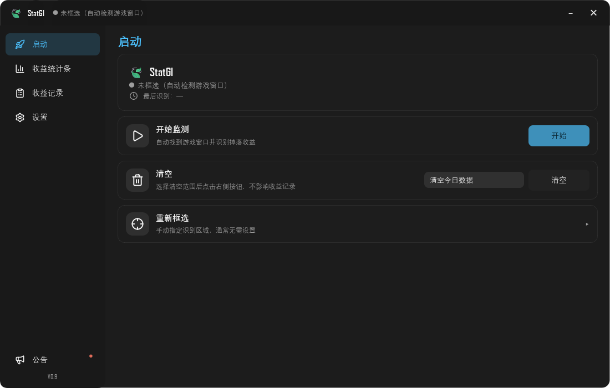
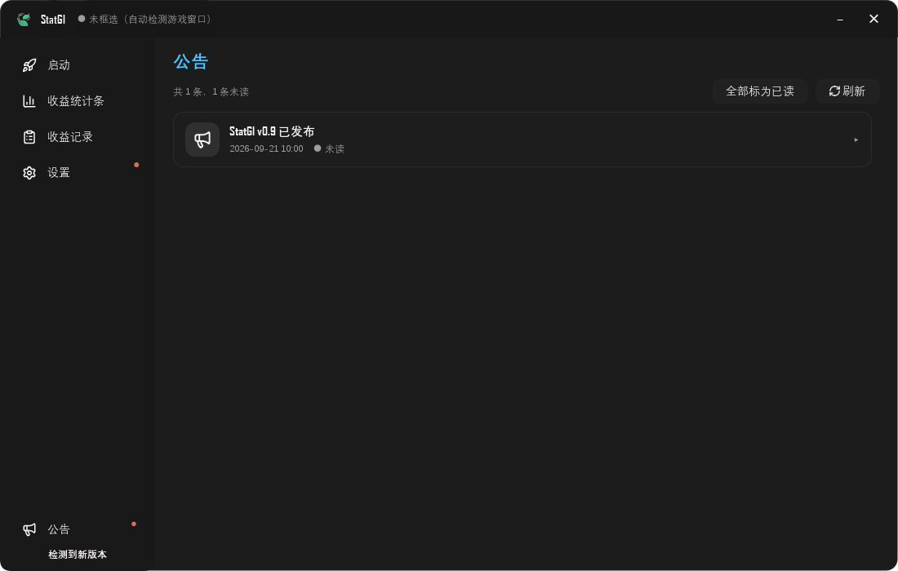
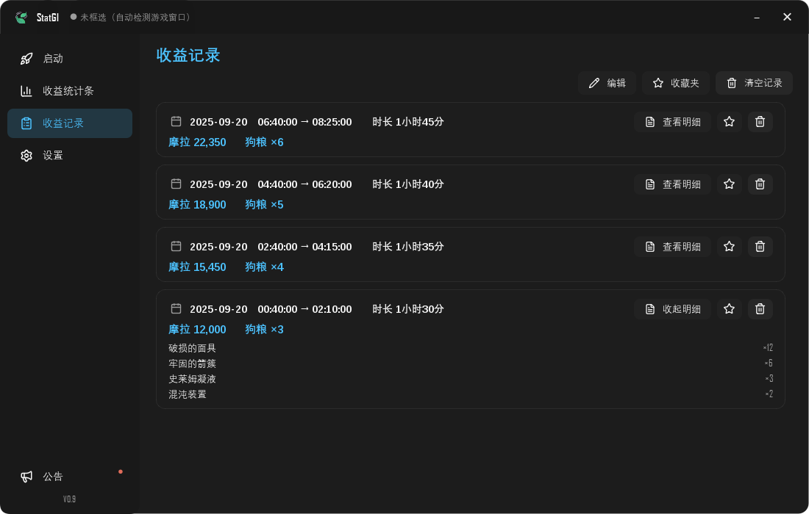
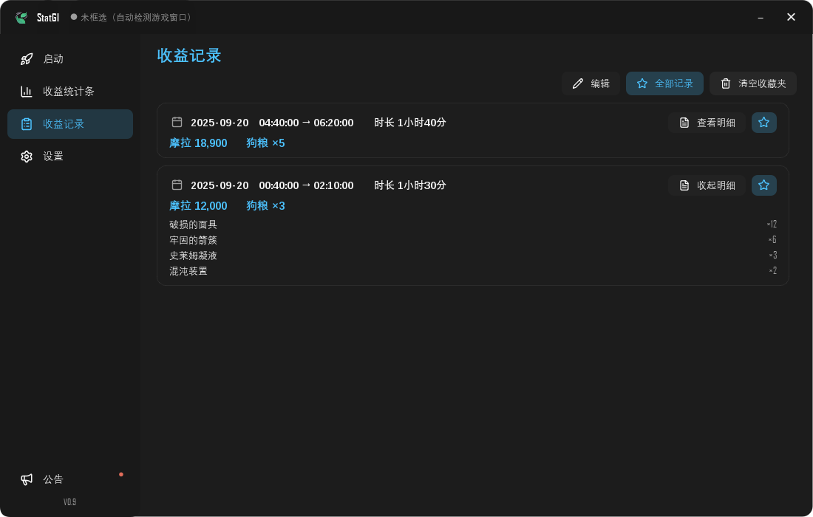
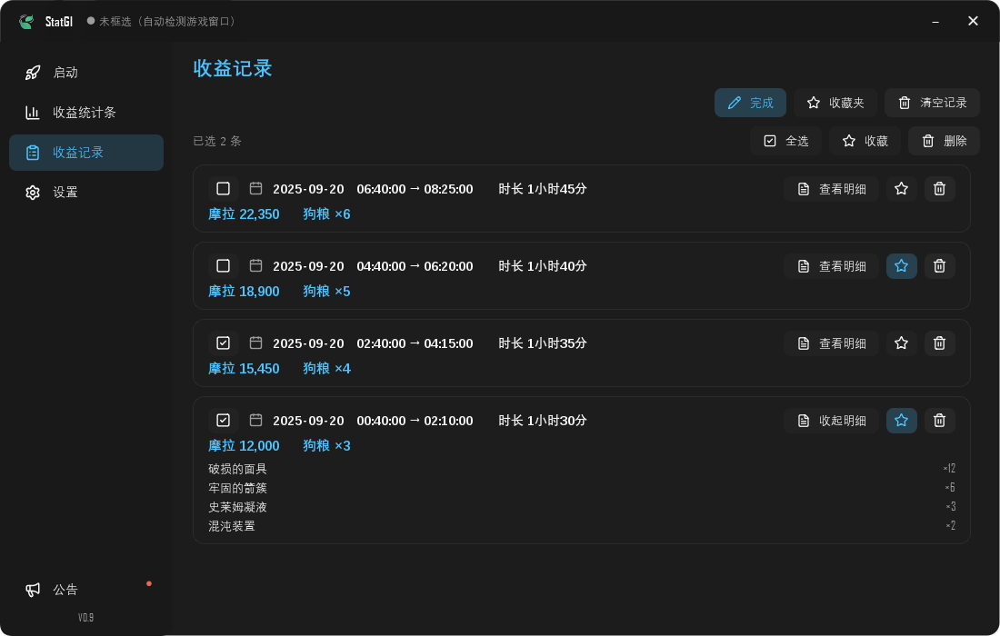
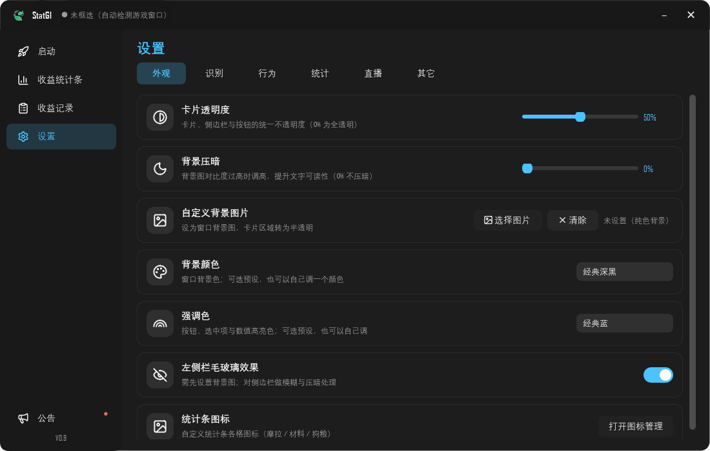
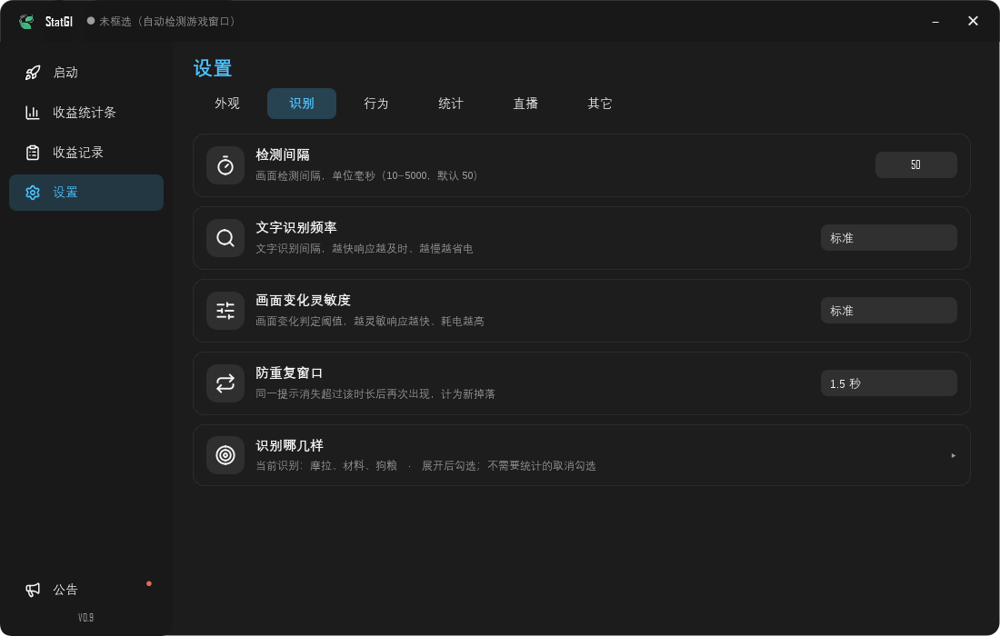
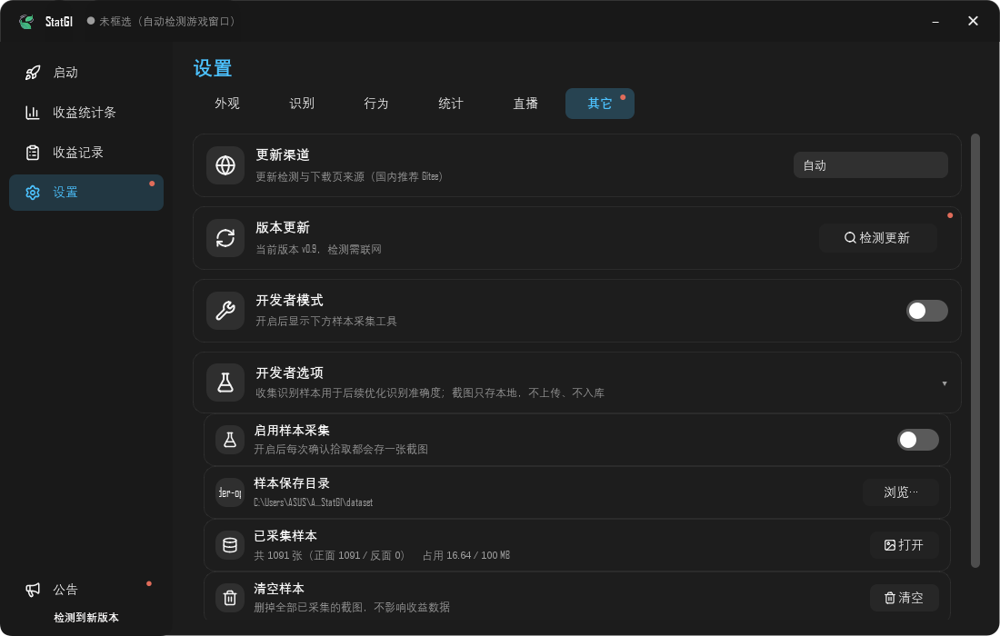

# StatGI 使用说明

原神挂机收益统计器。挂机时自动统计捡到的摩拉、材料和圣遗物。

只用屏幕识别 —— 不读游戏内存、不做注入、不控制游戏。

---

## 一、开始使用

**第 1 步**　打开原神，让游戏画面显示出来。

**第 2 步**　双击 `StatGI.exe` 启动。

- 第一次打开要等几秒，正常
- 弹出蓝色提示就点「更多信息」→「仍要运行」

**第 3 步**　在「启动」页点「开始监测」。

之后正常打游戏，捡到东西会自动记账。再点一次就是停止。

---

## 二、界面

侧栏四个页面：

- **启动**　开始 / 停止监测
- **收益统计条**　桌面悬浮窗的设置
- **收益记录**　每轮监测的明细
- **设置**　全部设置，分 6 类

侧栏底部还有「公告」，点开看更新说明。

---

## 三、能统计什么

**摩拉**　提示出现「摩拉 +xxxx」时累加

**材料**　按名字分开统计，比如「破损的面具 ×12」

**圣遗物**　出现一次算 1 个（不认具体属性）

原理是**读屏幕上的掉落提示文字**。所以：

- 提示文字越清楚，统计越准
- 同一条提示一直显示，只算一次，不会重复记账

---

## 四、想让统计更准

- 背景用**纯色** —— 设置 → 外观 → 自定义背景图片 → 清除
- 性能优先 —— 设置 → 识别 →「检测间隔」「文字识别频率」「画面变化灵敏度」全选「性能」

识别靠读屏幕，偶尔有出入是正常的：

- 提示一闪而过 → 会漏掉
- 画面糊、缩放过大 → 会认错字

---

## 五、桌面悬浮窗

「收益统计条」页点「打开统计条」，桌面出现小窗口，实时显示摩拉 / 材料 / 狗粮。

- 按住可拖动
- 「统计条透明度」调低，少挡游戏画面
- 显示哪几格、用什么图标，都能改

这个窗口**直播也能用** —— OBS 里加「窗口捕获」选中它（真透明，没有黑边）。

---

## 六、收益记录

一轮「开始 → 停止」算一条记录。每条右边三个按钮：

- **查看明细**　展开看掉了哪些材料
- **★**　收藏
- **🗑**　删除

### 收藏夹

点顶部「收藏夹」按钮切换。收藏是**复制一份**：

- 删掉原记录，收藏里那份还在
- 清空全部记录，收藏里那份也还在

### 编辑模式

点「编辑」，每条左边出现勾选框，可批量收藏 / 批量删除。

---

## 七、常改的设置

- 换界面颜色　设置 → 外观 → 背景颜色 / 强调色
- 卡片太透明　设置 → 外观 → 卡片透明度
- 改热键　设置 → 行为 → 全局热键
- 每天几点重置　设置 → 统计 → 换日刷新数据
- 只统计某几样　设置 → 识别 → 识别哪几样
- 换更新渠道　设置 → 其它 → 更新渠道

---

## 八、常见问题

**识别不到东西**
检查 设置 → 行为 →「只在原神前台时识别」—— 开着的话，切到别的窗口就会停。还是不行就把游戏改成窗口模式。

**数字比实际少**
提示消失太快，或被别的界面挡住。设置 → 识别 →「防重复窗口」调短一点。

**提示「程序已经在运行了」**
右下角托盘里找它，点一下就能打开。只允许开一个，不然会重复统计。

**窗口找不到了**
右下角托盘图标，双击。

**怎么彻底退出**
托盘图标右键 → 退出程序。点右上角 ✕ 只是最小化到托盘，监测还在跑。

**更新之后设置还在吗**
在。更新只换程序，`config` 和 `data` 文件夹都会保留。

**有新版本会提醒吗**
会。打开软件自动检查，左下角闪红色提示，点一下就能更新。

---

## 九、注意事项

- 不读游戏内存、不做注入、不控制游戏，只用屏幕截图 + 文字识别
- 识别结果存在本地 `data` 文件夹，**不会上传**
- 删程序时 `config` 和 `data` 会一起删掉，介意的话先备份

---

## 十、反馈

QQ 群：**1125970274**

GitHub：https://github.com/Cash-553/stat-genshin-impact
